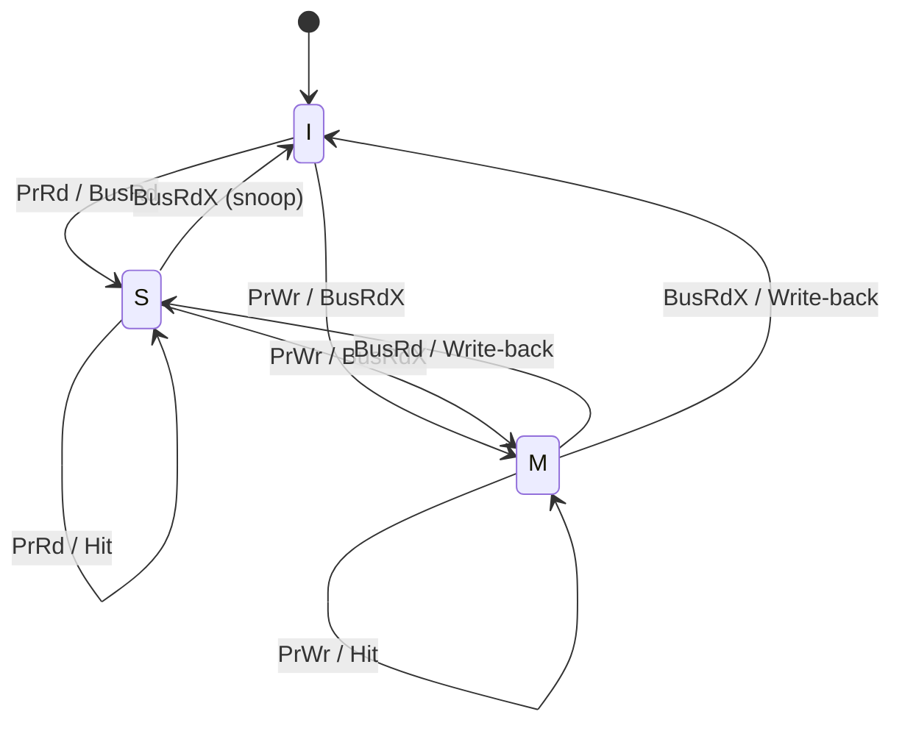
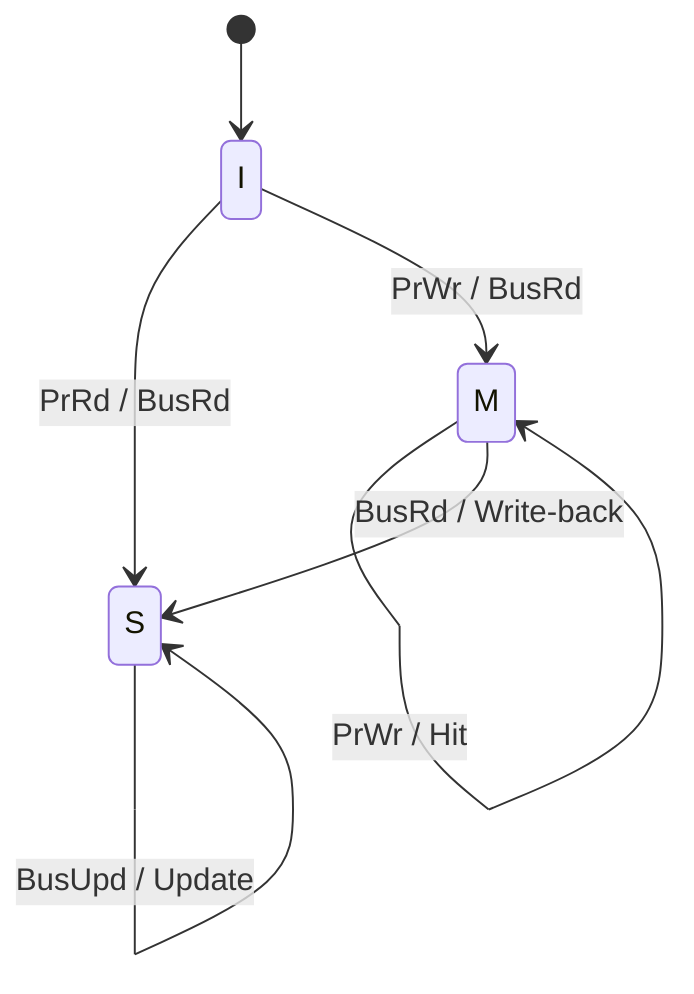

# Demostración 2

## Modelado del interconnect y protocolos de coherencia de caché

## Especificación formal del sistema

---

### 1. Introducción

En esta etapa del proyecto se profundiza en el modelado del sistema multicore propuesto, definiendo formalmente los parámetros arquitectónicos, el comportamiento del interconnect y los protocolos de coherencia de caché a evaluar.

El objetivo principal es construir un modelo consistente y reproducible que permita analizar de manera cuantitativa el impacto de protocolos write-invalidate y write-update sobre el tráfico en el bus, la latencia de acceso a memoria y la interacción entre múltiples elementos de procesamiento.

En esta fase se establecen de forma explícita las reglas de funcionamiento del sistema, incluyendo temporización, transacciones del bus y máquinas de estados de coherencia, con el fin de garantizar que la implementación sea coherente y los resultados obtenidos sean comparables.

---

### 2. Especificación del sistema

El sistema modelado mantiene la estructura general definida previamente, pero ahora se detallan completamente sus parámetros internos.

#### 2.1 Parámetros base

* Arquitectura: 4 cores
* Tamaño de palabra: 32 bits
* Tamaño de dirección: 32 bits

La selección de una arquitectura de 32 bits permite simplificar el modelado sin perder generalidad, ya que sigue siendo representativa de muchos sistemas embebidos y facilita el manejo de direcciones y datos dentro de la simulación.

---

#### 2.2 Caché L1

Cada core posee una caché privada con las siguientes características:

* Tamaño total: 2 KB
* Organización: direct-mapped
* Tamaño de bloque: 32 bytes
* Política de escritura: write-back con write-allocate

Derivación de parámetros:

* Número de líneas: 2048 / 32 = 64
* Offset: 5 bits
* Índice: 6 bits
* Tag: 21 bits

La selección de un tamaño de bloque de 32 bytes permite un balance entre localidad espacial y complejidad de modelado. Además, la organización direct-mapped simplifica el acceso y elimina la necesidad de lógica de reemplazo, lo cual facilita la implementación sin eliminar fenómenos relevantes como conflictos de mapeo.

La política write-back reduce el tráfico hacia memoria principal, haciendo que el comportamiento del protocolo de coherencia sea más relevante. Por su parte, write-allocate asegura que las escrituras generen actividad en caché, lo cual es necesario para activar eventos de coherencia.

---

#### 2.3 Modelo temporal

Se define un modelo de latencias simplificado pero consistente:

* Hit en L1: 1 ciclo
* Arbitraje del bus: 2 ciclos
* Transferencia en bus: 2 ciclos
* Acceso a memoria principal: 20 ciclos

Esto produce una penalización de fallo de caché aproximada de 24 ciclos.

Estas latencias permiten diferenciar claramente entre accesos rápidos (hit) y accesos costosos (miss), lo cual es fundamental para que las métricas de desempeño reflejen el impacto real del interconnect y los protocolos de coherencia.

---

#### 2.4 Interconnect (bus)

* Tipo: bus compartido
* Ancho: 32 bits
* Modelo: bloqueante (una transacción a la vez)
* Arbitraje: round-robin

Las transacciones del bus se modelan con un costo fijo, evitando modelar transferencia palabra por palabra, lo cual simplifica el diseño sin perder la noción de costo temporal.

El uso de un bus bloqueante permite observar de forma clara la contención entre cores, mientras que el arbitraje round-robin garantiza equidad en el acceso y evita sesgos en los resultados.

---

### 3. Modelo de coherencia de caché

Se implementan dos protocolos: MSI (write-invalidate) y una variante simplificada de Firefly (write-update).

---

#### 3.1 Protocolo MSI

Estados:

* M (Modified)
* S (Shared)
* I (Invalid)

Eventos:

* Procesador:
  * PrRd (lectura)
  * PrWr (escritura)
* Bus (snooping):
  * BusRd
  * BusRdX

---

##### Descripción del protocolo

El protocolo MSI es un esquema de coherencia basado en invalidación, en el cual múltiples copias de un bloque pueden coexistir en estado Shared, pero únicamente una puede estar en estado Modified. Cuando un procesador desea escribir sobre un bloque compartido, invalida las demás copias mediante una transacción en el bus (BusRdX), garantizando exclusividad antes de la modificación.

Este enfoque reduce el tráfico en el bus en comparación con protocolos de actualización, ya que no se transmiten datos en cada escritura, pero introduce mayor latencia cuando otros procesadores requieren acceder nuevamente al dato invalidado.

---

##### Transiciones principales (eventos del procesador)

| Estado | Evento | Acción |
|------|------|--------|
| I | PrRd | Miss -> BusRd -> S |
| I | PrWr | Miss -> BusRdX -> M |
| S | PrRd | Hit |
| S | PrWr | BusRdX -> M |
| M | PrRd | Hit |
| M | PrWr | Hit |

---

##### Snooping (eventos del bus)

| Estado | Evento | Acción |
|------|--------|--------|
| S | BusRd | Permanece en S |
| S | BusRdX | -> I |
| M | BusRd | Write-back -> S |
| M | BusRdX | Write-back -> I |

---

##### Consideraciones

El protocolo MSI garantiza coherencia mediante la invalidación de copias remotas. Cuando un bloque en estado Modified es solicitado por otro procesador, se fuerza un write-back a memoria, asegurando que los datos compartidos estén actualizados.

Este comportamiento genera un patrón característico: menor tráfico de datos en el bus, pero mayor número de misses en accesos posteriores.

---

##### Diagrama FSM (MSI)

---

#### 3.2 Protocolo Firefly (write-update)

Estados:

* M (Modified)
* S (Shared)
* I (Invalid)

Eventos:

* Procesador:

  * PrRd
  * PrWr
* Bus:

  * BusRd
  * BusUpd

---

##### Descripción del protocolo

El protocolo Firefly corresponde a una familia de protocolos write-update, donde las escrituras sobre datos compartidos no invalidan las copias remotas, sino que propagan el nuevo valor a través del bus.

Este enfoque fue utilizado en la estación de trabajo multiprocesador Firefly [4], donde se prioriza mantener múltiples copias coherentes mediante actualizaciones broadcast, reduciendo la necesidad de recargar datos desde memoria.

A diferencia de MSI, Firefly busca minimizar fallos de caché posteriores, especialmente en escenarios donde múltiples procesadores acceden y modifican frecuentemente los mismos datos.

---

##### Regla fundamental

Cuando un bloque está en estado Shared y ocurre una escritura:

* Se emite un BusUpd
* Todas las cachés con copia válida actualizan su contenido
* El bloque permanece en estado Shared

---

##### Transiciones principales

| Estado | Evento | Acción     |
| ------ | ------ | ---------- |
| I      | PrRd   | BusRd -> S  |
| I      | PrWr   | BusRd -> M  |
| S      | PrRd   | Hit        |
| S      | PrWr   | BusUpd -> S |
| M      | PrRd   | Hit        |
| M      | PrWr   | Hit        |

---

##### Snooping

| Estado | Evento | Acción          |
| ------ | ------ | --------------- |
| S      | BusUpd | Actualizar dato |
| S      | BusRd  | Permanece en S  |
| M      | BusRd  | Write-back -> S  |

---

##### Consideraciones

El protocolo Firefly elimina la necesidad de invalidaciones en la mayoría de los casos, lo cual reduce significativamente los fallos de caché en accesos posteriores. Sin embargo, esto introduce mayor tráfico en el bus debido a las actualizaciones broadcast.

Este comportamiento resulta particularmente eficiente en escenarios de alta compartición, donde múltiples procesadores acceden y modifican frecuentemente el mismo dato, como se describe en [3] y [4].

En términos generales:

* MSI -> menos tráfico, más misses
* Firefly -> más tráfico, menos misses

---

##### Diagrama FSM (Firefly)

---

### 4. Protocolo del bus

Tipos de transacciones:

* BusRd: lectura de bloque
* BusRdX: lectura con intención de escritura (invalida otras copias)
* BusUpd: actualización broadcast

El bus opera bajo un modelo bloqueante, donde solo una transacción puede estar activa en un momento dado. Las solicitudes se gestionan mediante una cola FIFO con arbitraje round-robin.

Para simplificar el modelo, la memoria principal es la encargada de responder todas las solicitudes de lectura, mientras que las cachés únicamente intervienen en caso de write-back cuando poseen una línea en estado Modified.

Esta decisión evita la complejidad de transferencias cache-to-cache, manteniendo el enfoque del proyecto en el análisis del tráfico del interconnect.

---

### 5. Modelo de memoria

* Latencia fija: 20 ciclos
* Atiende una solicitud a la vez
* Cola FIFO de solicitudes

Cuando una línea en estado Modified debe ser reemplazada o invalidada, se realiza un write-back hacia memoria antes de completar la transición de estado.

El uso de un modelo de memoria simple permite aislar el impacto del bus y los protocolos de coherencia, evitando introducir variabilidad adicional que complique el análisis.

---

### 6. Métricas a evaluar

Se definen métricas específicas para capturar el comportamiento del sistema:

#### 6.1 Métricas globales

* Número total de accesos
* Número de lecturas y escrituras
* Hit rate
* Miss rate

---

#### 6.2 Métricas de coherencia

* MSI: número de invalidaciones
* Firefly: número de actualizaciones

Estas métricas permiten comparar directamente el impacto de cada protocolo sobre el sistema.

---

#### 6.3 Métricas del bus

* Número de transacciones BusRd
* Número de transacciones BusRdX
* Número de transacciones BusUpd
* Tráfico total en el bus

---

#### 6.4 Métricas de desempeño

* Latencia promedio por acceso a memoria

---

#### 6.5 Ubicación de medición

* Caché: hits y misses
* Bus: transacciones
* Monitor global: agregación de métricas

La separación de responsabilidades permite mantener un diseño modular y facilita la recolección consistente de datos.

---

### 7. Definición formal de workloads

Se formalizan los patrones de acceso definidos previamente para garantizar reproducibilidad.

---

#### 7.1 Alta contención

Variable compartida X:

* Core0: Write(X)
* Core1: Read(X)
* Core2: Write(X)
* Core3: Read(X)

Este patrón se repite múltiples veces de forma determinística, generando alta contención y frecuentes eventos de coherencia.

---

#### 7.2 Productor–Consumidor

* Dos cores producen datos en un buffer compartido
* Dos cores consumen datos del mismo buffer

El buffer se limita a un conjunto pequeño de direcciones (8–16), lo cual incrementa la probabilidad de compartición y tráfico en el bus.

---

#### 7.3 Migración de ownership

Una misma dirección es escrita de forma alternada:

* Core0 → Core1 → Core2 → Core3 → ...

Este patrón genera transferencias constantes de ownership, siendo particularmente demandante para protocolos basados en invalidación.

---

### 8. Arquitectura del modelo

El sistema se organiza en los siguientes componentes:

* Cache
* CacheLine
* Bus
* Memory
* Core
* WorkloadGenerator
* Monitor

La comunicación entre módulos se realiza mediante mailboxes, permitiendo modelar concurrencia y desacoplar los componentes del sistema.

Esta estructura modular facilita la implementación de los protocolos de coherencia y permite extender el sistema sin modificar su organización base.

---

### 9. Interacción entre componentes

Core -> Cache:

* Solicitudes de lectura y escritura

Cache -> Bus:

* Solicitudes de transacción (BusRd, BusRdX, BusUpd)

Bus -> Caches:

* Broadcast de eventos (snooping)

Bus -> Memory:

* Solicitudes de acceso a memoria

Memory -> Bus:

* Respuestas a solicitudes

Monitor:

* Recolección de métricas desde caché y bus

Esta interacción define claramente el flujo de información dentro del sistema y asegura consistencia en el modelado de eventos.

---

### 10. Lenguaje de implementación

* Lenguaje seleccionado: SystemVerilog

---

### Referencias

[1] J. L. Hennessy and D. A. Patterson, *Computer Architecture: A Quantitative Approach*, 6th ed. Elsevier, 2017.

[2] V. Nagarajan et al., *A Primer on Memory Consistency and Cache Coherence*. Morgan & Claypool, 2020.

[3] J. Archibald and J.-L. Baer, “Cache Coherence Protocols: Evaluation Using a Multiprocessor Simulation Model,” *ACM Transactions on Computer Systems*, 1986.

[4] C. P. Thacker, L. C. Stewart, and E. H. Satterthwaite Jr., “Firefly: A Multiprocessor Workstation,” *IEEE Transactions on Computers*, 1988.